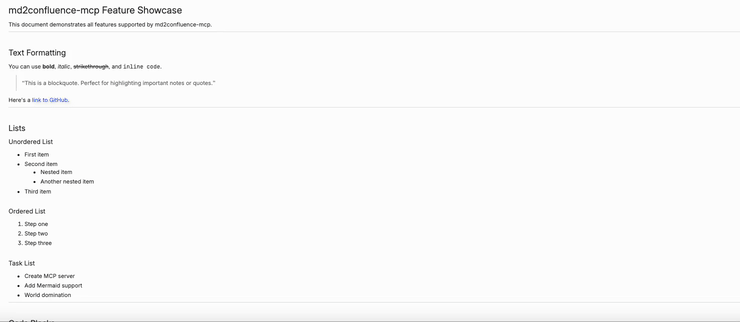
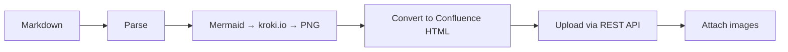

# md2confluence-mcp

**Markdown to Confluence converter** — MCP server that uploads Markdown files to Atlassian Confluence with auto-converted Mermaid diagrams, code blocks, and images.

[](https://www.npmjs.com/package/md2confluence-mcp)
[](https://opensource.org/licenses/MIT)

## Demo



> Uploading [showcase.md](./docs/showcase.md) to Confluence with images and Mermaid diagrams

## Features

- ✅ **Mermaid diagrams** → PNG (auto-converted via kroki.io)
- ✅ **Code blocks** → Confluence Code macro
- ✅ **Images** → Attachments (auto-uploaded)
- ✅ **Tables, links, formatting** → Preserved

## Installation

### Claude Code

Add to your Claude Code settings (`~/.claude/settings.json`):

```json
{
  "mcpServers": {
    "confluence": {
      "command": "npx",
      "args": ["-y", "md2confluence-mcp"],
      "env": {
        "CONFLUENCE_URL": "https://your-domain.atlassian.net/wiki",
        "CONFLUENCE_EMAIL": "your@email.com",
        "CONFLUENCE_TOKEN": "YOUR_API_TOKEN"
      }
    }
  }
}
```

### Project-specific

Add to your project's `.mcp.json`:

```json
{
  "mcpServers": {
    "confluence": {
      "command": "npx",
      "args": ["-y", "md2confluence-mcp"],
      "env": {
        "CONFLUENCE_URL": "https://your-domain.atlassian.net/wiki",
        "CONFLUENCE_EMAIL": "your@email.com",
        "CONFLUENCE_TOKEN": "YOUR_API_TOKEN"
      }
    }
  }
}
```

## Get API Token

1. Go to https://id.atlassian.com/manage/api-tokens
2. Click "Create API token"
3. Copy the token to `CONFLUENCE_TOKEN`

## Usage

Once configured, Claude Code can use these tools automatically.

### Prompt Examples

#### Upload to your personal space

```
"Upload README.md to my personal Confluence space"
```

```
"Upload this document to my Confluence space"
```

#### Upload to a specific space (with URL)

```
"Upload docs/SETUP.md to Confluence here: https://company.atlassian.net/wiki/spaces/TEAM/overview"
```

```
"Create a new page in https://company.atlassian.net/wiki/spaces/~712020170fdaa4716743419285f156aa587665/overview with this content"
```

#### Update an existing page

```
"Update this Confluence page with the latest content: https://company.atlassian.net/wiki/spaces/TEAM/pages/123456/My+Page"
```

```
"Sync docs/API.md to https://company.atlassian.net/wiki/spaces/EN/pages/789012/API+Reference"
```

#### Create a child page (sub-page)

```
"Create a new page under https://company.atlassian.net/wiki/spaces/TEAM/pages/123456/Parent+Page"
```

```
"Add a sub-page to this page: https://company.atlassian.net/wiki/spaces/EN/pages/789012/Guide"
```

#### List and search

```
"Show me available Confluence spaces"
```

```
"Find Confluence pages about authentication in the EN space"
```

### Space Key Format

| Type | Format | Example |
|------|--------|---------|
| Global space | Short key | `TEAM`, `EN`, `PROD` |
| Personal space | `~` + ID | `~712020170fdaa4716743419285f156aa587665` |

**Tip:** You can extract the space key from a Confluence URL:
```
https://company.atlassian.net/wiki/spaces/TEAM/overview
                                        ^^^^ space key

https://company.atlassian.net/wiki/spaces/~712020.../overview
                                        ^^^^^^^^^^ personal space key
```

## Tools

| Tool | Description |
|------|-------------|
| `upload_page` | Create a new Confluence page from Markdown |
| `update_page` | Update an existing page |
| `create_child_page` | Create a new page under an existing page |
| `sync_file` | Sync a local file to an existing page |
| `list_spaces` | List available spaces |
| `search_pages` | Search for pages |

## How It Works



1. **Parse** - Extract content, remove front matter
2. **Render** - Convert Mermaid diagrams to PNG via [kroki.io](https://kroki.io)
3. **Convert** - Transform Markdown to Confluence storage format
4. **Upload** - Create/update page via Confluence REST API
5. **Attach** - Upload images as page attachments

## Environment Variables

| Variable | Required | Description |
|----------|----------|-------------|
| `CONFLUENCE_URL` | ✅ | e.g., `https://your-domain.atlassian.net/wiki` |
| `CONFLUENCE_EMAIL` | ✅ | Your Atlassian account email |
| `CONFLUENCE_TOKEN` | ✅ | API token |

## Development

```bash
# Clone
git clone https://github.com/Gyeom/md2confluence-mcp.git
cd md2confluence-mcp

# Install dependencies
npm install

# Build
npm run build

# Test locally
CONFLUENCE_URL=... CONFLUENCE_EMAIL=... CONFLUENCE_TOKEN=... npm start
```

## License

MIT

## Credits

- [kroki.io](https://kroki.io) - Diagram rendering API
- [Model Context Protocol](https://modelcontextprotocol.io) - MCP SDK
- [Confluence REST API](https://developer.atlassian.com/cloud/confluence/rest/)
