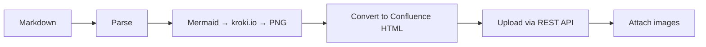

# md2confluence-mcp

**MCP server for uploading Markdown to Confluence with images.**

[](https://www.npmjs.com/package/md2confluence-mcp)
[](https://opensource.org/licenses/MIT)

## Features

- ✅ **Mermaid diagrams** → PNG (auto-converted via kroki.io)
- ✅ **Code blocks** → Confluence Code macro
- ✅ **Images** → Attachments (auto-uploaded)
- ✅ **Tables, links, formatting** → Preserved

## Installation

### Claude Code

Add to your Claude Code settings (`~/.claude/settings.json`):

```json
{
  "mcpServers": {
    "confluence": {
      "command": "npx",
      "args": ["-y", "md2confluence-mcp"],
      "env": {
        "CONFLUENCE_URL": "https://your-domain.atlassian.net/wiki",
        "CONFLUENCE_EMAIL": "your@email.com",
        "CONFLUENCE_TOKEN": "YOUR_API_TOKEN"
      }
    }
  }
}
```

### Project-specific

Add to your project's `.mcp.json`:

```json
{
  "mcpServers": {
    "confluence": {
      "command": "npx",
      "args": ["-y", "md2confluence-mcp"],
      "env": {
        "CONFLUENCE_URL": "https://your-domain.atlassian.net/wiki",
        "CONFLUENCE_EMAIL": "your@email.com",
        "CONFLUENCE_TOKEN": "YOUR_API_TOKEN"
      }
    }
  }
}
```

## Get API Token

1. Go to https://id.atlassian.com/manage/api-tokens
2. Click "Create API token"
3. Copy the token to `CONFLUENCE_TOKEN`

## Usage

Once configured, Claude Code can use these tools automatically:

### Upload a new page

```
"Upload this document to Confluence in the TEAM space"
```

Claude will call `upload_page` with the Markdown content.

### Update existing page

```
"Update the Confluence page at [URL] with this content"
```

### List spaces

```
"Show me available Confluence spaces"
```

### Search pages

```
"Find Confluence pages about authentication"
```

## Tools

| Tool | Description |
|------|-------------|
| `upload_page` | Create a new Confluence page from Markdown |
| `update_page` | Update an existing page |
| `list_spaces` | List available spaces |
| `search_pages` | Search for pages |

## How It Works



1. **Parse** - Extract content, remove front matter
2. **Render** - Convert Mermaid diagrams to PNG via [kroki.io](https://kroki.io)
3. **Convert** - Transform Markdown to Confluence storage format
4. **Upload** - Create/update page via Confluence REST API
5. **Attach** - Upload images as page attachments

## Environment Variables

| Variable | Required | Description |
|----------|----------|-------------|
| `CONFLUENCE_URL` | ✅ | e.g., `https://your-domain.atlassian.net/wiki` |
| `CONFLUENCE_EMAIL` | ✅ | Your Atlassian account email |
| `CONFLUENCE_TOKEN` | ✅ | API token |

## Development

```bash
# Clone
git clone https://github.com/Gyeom/md2confluence-mcp.git
cd md2confluence-mcp

# Install dependencies
npm install

# Build
npm run build

# Test locally
CONFLUENCE_URL=... CONFLUENCE_EMAIL=... CONFLUENCE_TOKEN=... npm start
```

## License

MIT

## Credits

- [kroki.io](https://kroki.io) - Diagram rendering API
- [Model Context Protocol](https://modelcontextprotocol.io) - MCP SDK
- [Confluence REST API](https://developer.atlassian.com/cloud/confluence/rest/)
