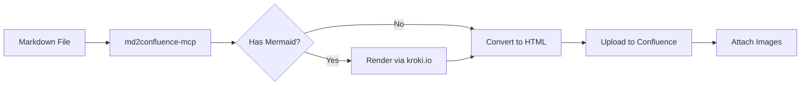
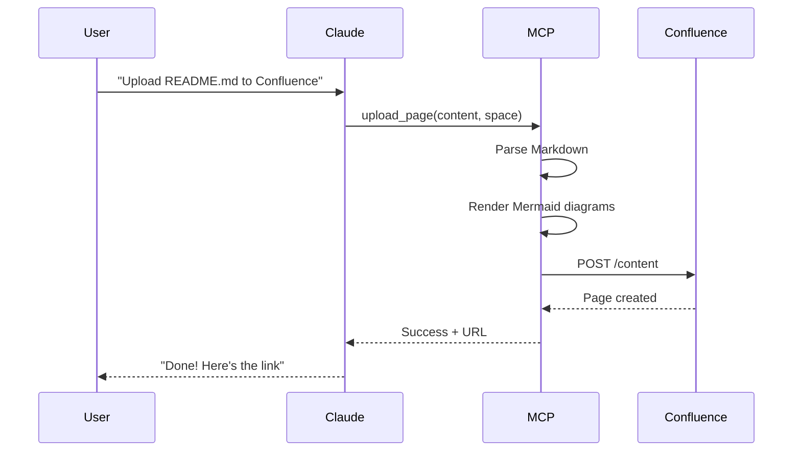
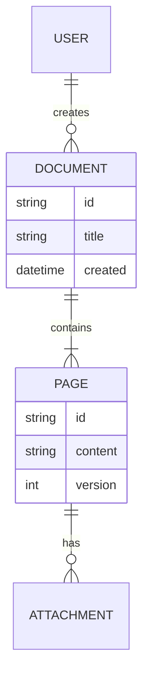
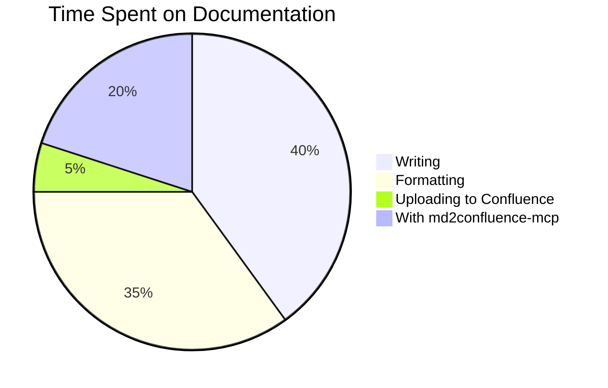

# md2confluence-mcp Feature Showcase

This document demonstrates all features supported by md2confluence-mcp.

---

## Text Formatting

You can use **bold**, *italic*, ~~strikethrough~~, and `inline code`.

> This is a blockquote. Perfect for highlighting important notes or quotes.

Here's a [link to GitHub](https://github.com/Gyeom/md2confluence-mcp).

---

## Lists

### Unordered List
- First item
- Second item
  - Nested item
  - Another nested item
- Third item

### Ordered List
1. Step one
2. Step two
3. Step three

### Task List
- [x] Create MCP server
- [x] Add Mermaid support
- [ ] World domination

---

## Code Blocks

### JavaScript
```javascript
const WebSocket = require('ws');

const ws = new WebSocket('wss://api.example.com/stream');

ws.on('message', (data) => {
  console.log('Received:', data);
});
```

### Python
```python
def fibonacci(n):
    if n <= 1:
        return n
    return fibonacci(n - 1) + fibonacci(n - 2)

print(fibonacci(10))  # Output: 55
```

### Bash
```bash
# Install and run
npm install -g md2confluence-mcp
md2confluence-mcp --help
```

---

## Tables

| Feature | Status | Notes |
|---------|--------|-------|
| Markdown parsing | ✅ | Full CommonMark support |
| Code blocks | ✅ | Syntax highlighting |
| Mermaid diagrams | ✅ | Auto-converted to PNG |
| Image uploads | ✅ | Attached automatically |
| Tables | ✅ | You're looking at one! |

---

## Mermaid Diagrams

### Flowchart


### Sequence Diagram


### Entity Relationship Diagram


### Pie Chart


---

## Horizontal Rules

Use `---` to create horizontal rules like the ones separating sections.

---

## Summary

This showcase demonstrates:

1. **Text formatting** - Bold, italic, strikethrough, inline code
2. **Block quotes** - For important notes
3. **Links** - External and internal
4. **Lists** - Ordered, unordered, and task lists
5. **Code blocks** - With syntax highlighting
6. **Tables** - For structured data
7. **Mermaid diagrams** - Flowcharts, sequence diagrams, ER diagrams, pie charts
8. **Horizontal rules** - For visual separation

All of this converts seamlessly to Confluence with a single command! 🚀
